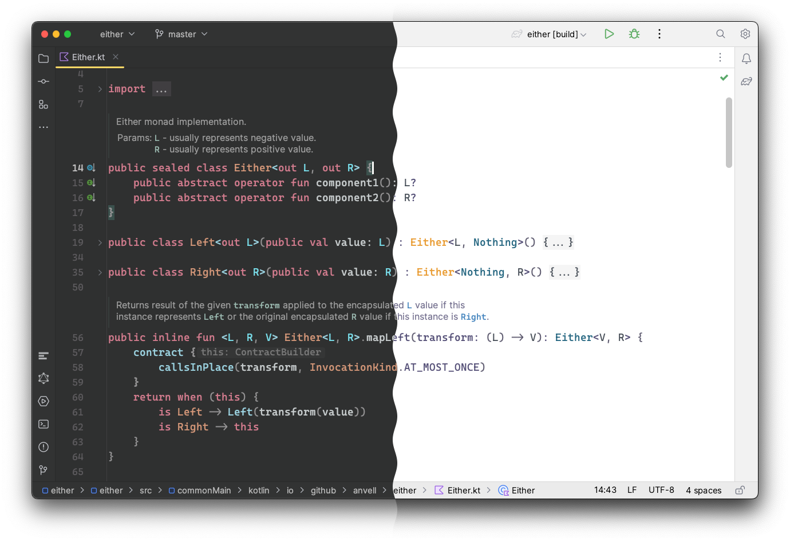

    

<h2 align="center">
	Dune theme for <a href="https://www.jetbrains.com/ides">Intellij</a> IDEs
</h2>

     

Harmonic and flow inducing color schemes which are gentle for your eyes.

### 📦 Installation

- [Intellij plugin](https://plugins.jetbrains.com/plugin/21279-dune-theme) offers both light and dark themes.

### Showcase

    

### Credits

- [White Sand](https://github.com/mswift42/intellij-ui-themes) `Arrakis Day` design is based on its color scheme.
